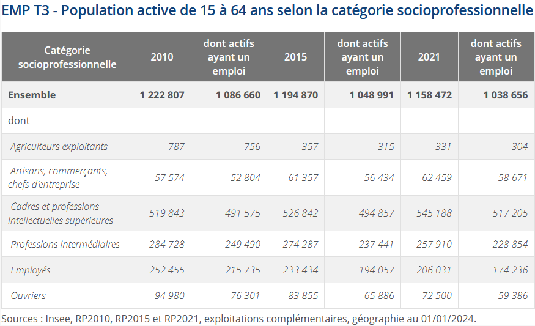
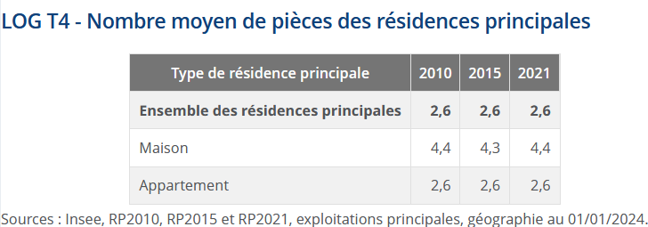

# Quelles questions intéressantes pour une "fouille de données" sur la base des RP ? {#sec-Questions-fouille-donnees}

```{r message=FALSE, warning=FALSE, include=FALSE}
# Chargement des librairies
library(tidyverse)
library(gt)

# Chargement des tables
RP_final <- readRDS(file = "data/RP_final.Rdata")
meta <- readRDS(file = "data/meta.Rdata")
```

Quelles sont les questions intéressantes que l'on peut se poser ? Qu'est-ce qu'on va pouvoir mettre en évidence à partir de ces données ?

D'abord, on peut caractériser la population de Paris et sa petite couronne selon des variables socio-démographiques (sexe, âge, diplôme, statut conjugal, nombre d'enfants, ...) et d'emploi (statut d'activité, PCS, condition d'emploi - contrat, temps de travail -, secteur d'activité, ...). Ensuite, on peut décrire les logements de Paris et sa petite couronne, selon le type (appartement, maison, HLM, ...), la superficie, le nombre de pièces, le nombre de personnes y habitant, le statut d'occupation (propriétaire, locataire, ...), l'ancienneté d'occupation. Enfin, on peut décrire plus précisément les pièces du logement en termes de confort (baignoire / douche, salle climatisée, moyen de chauffage), ainsi que les parties communes de l'immeuble (ascenseur, place de stationnement). Enfin, on pourrait étudier les caractéristiques des occupants de ces logements, et en premier lieu ici ce que l'Insee appelle la "personne de référence du ménage". Par ailleurs, toutes ces analyses peuvent être réalisées en comparant les différentes communes de Paris et sa petite couronne, ou à un niveau géographique plus fin par quartiers, arrondissements ou encore IRIS.

Pour manipuler cette base et répondre à quelques-unes de ces questions, nous allons nous concentrer sur la commune de Paris, et allons chercher à reproduire des statistiques publiées sur le site de l'Insee. Nous produirons principalement, lors de cette séance, des tableaux de statistiques, l'analyse graphique fera en effet l'objet de la séance suivante car elle nécessite la présentation détaillée de la "grammaire" **`Ggplot`**.

Avant cela, si les tables de données ("RP_final" et "meta") ne sont plus dans votre environnement local, il faut de nouveau les importer à partir de l'enregistrement précédemment effectué dans le dossier 'data' de votre projet. Pour cela, il faut utiliser la fonction `readRDS()`, comme ci-dessous :


## Caractéristiques de la population résidant à Paris

Sur le site de l'Insee, vous pouvez trouver les statistiques générales sur les individus à Paris en 2021 <a href="https://www.insee.fr/fr/statistiques/8200783?geo=DEP-75" target="_blank">ici</a> et <a href="https://www.insee.fr/fr/statistiques/8201650?geo=DEP-75" target="_blank">là</a>.

Comme déjà vu lors de la 1ère séance, l'application de la pondération pour avoir des statistiques représentatives de la population peut être utilisée à l'intérieur de la fonction `count()` avec l'argument `wt=`. Cela nous donnera le nombre d'individus concernés par la caractéristique étudiée (par défaut, la variable créée s'appelle "n", on peut la renommer dans une étape ultérieure avec la fonction `rename()`). Souvent, on souhaite aussi avoir les pourcentages, on peut alors créer une variable rapportant le nombre de chaque catégorie sur le nombre total d'individus, avec la fonction `prop.table()` utilisée dans la fonction `mutate()`. Le package **`janitor`** peut permettre enfin d'ajouter une ligne totale (ou une colonne totale selon ce qu'on souhaite faire) avec la fonction `adorn_totals()`, argument "row" pour avoir le total en ligne ou "col" pour l'avoir en colonne. Des fonctions supplémentaires liées au package **`gt()`** peuvent ensuite être utilisées pour mettre en forme le tableau : `fmt_number()`, `tab_header()` ou encore `tab_source_note()`.

A partir de ces indications, afficher le tableau suivant à partir d'un code utilisant le langage **tidyverse** et en une seule procédure (sans créer de table dans votre environnement) :

```{r echo=FALSE, warning=FALSE, message=FALSE}
library(tidyverse)
library(janitor)
library(gt)
RP_final %>% 
  filter(DEPT == "75") %>% 
  mutate(SEXE = case_when(SEXE=="1" ~ "Hommes", SEXE=="2" ~ "Femmes")) %>% 
  count(SEXE, wt = IPONDI) %>% 
  mutate(Pourcentage = round(prop.table(n)*100, 1)) %>% 
  adorn_totals("row") %>% 
  rename(Effectif = n, 'Sexe' = SEXE) %>% 
  gt() %>% 
  fmt_number(columns = 2, sep_mark = " ", decimals = 0) %>% 
  tab_header(title = "Population par sexe en 2021") %>% 
  tab_source_note(source_note = "Source : Insee, RP 2021 ; Champ : Paris.")
```

::: {.callout-tip collapse="true"}
## Solution

```{r message=FALSE, eval=FALSE}
library(tidyverse)
library(janitor)
library(gt)
RP_final %>% 
  filter(DEPT == "75") %>% 
  mutate(SEXE=case_when(SEXE=="1" ~ "Hommes", SEXE=="2" ~ "Femmes")) %>% 
  count(SEXE, wt=IPONDI) %>% 
  mutate(Pourcentage=round(prop.table(n)*100, 1)) %>% 
  adorn_totals("row") %>% 
  rename(Effectif=n, 'Sexe'=SEXE) %>% 
  gt() %>% 
  fmt_number(columns = 2, sep_mark = " ", decimals = 0) %>% 
  tab_source_note(source_note = "Source : Insee, RP 2021 ; Champ : Paris.") %>% 
  tab_header(title = "Population par sexe en 2021")
```
:::

Il y a plus de femmes habitant Paris en 2021, environ 53%.

Cherchons maintenant la répartition de la population parisienne par type d'activité : quelle est la proportion d'actifs ayant un emploi par rapport à la part des chômeurs ou encore des retraités ? Attention au champ sur lequel porte ces statistiques (lire le titre du tableau pour cela...).

```{r echo=FALSE}
RP_final %>% 
  filter(DEPT == "75" & AGEREV>14 & AGEREV<65) %>% 
  mutate(TACT=case_when(TACT == "11" ~ "Actifs ayant un emploi",
                             TACT == "12" ~ "Chômeurs",
                             TACT == "22" ~ "Élèves, étudiants et stagiaires non rémunérés",
                             TACT == "21" ~ "Retraités ou préretraités",
                             TRUE ~ "Autres inactifs"),
         TACT=fct_relevel(TACT, c("Actifs ayant un emploi", "Chômeurs",
                                            "Élèves, étudiants et stagiaires non rémunérés", 
                                            "Retraités ou préretraités", "Autres inactifs"))) %>% 
  count(TACT, wt=IPONDI) %>% 
  mutate(Pourcentage=round(prop.table(n)*100,1)) %>% 
  adorn_totals("row") %>% 
  rename(Effectif=n, "Type d'activité"=TACT) %>% 
  gt() %>% 
  fmt_number(columns = 2, sep_mark = " ", decimals = 0) %>% 
  tab_header(title = "Population des 15-64 ans par type d'activité en 2021") %>% 
  tab_source_note(source_note = "Source : Insee, RP 2021 ; Champ : Paris.")
```

::: {.callout-tip collapse="true"}
## Solution

```{r message=FALSE, eval=FALSE}
RP_final %>% 
  filter(DEPT == "75" & AGEREV>14 & AGEREV<65) %>% 
  mutate(TACT=case_when(TACT == "11" ~ "Actifs ayant un emploi",
                             TACT == "12" ~ "Chômeurs",
                             TACT == "22" ~ "Élèves, étudiants et stagiaires non rémunérés",
                             TACT == "21" ~ "Retraités ou préretraités",
                             TRUE ~ "Autres inactifs"),
         TACT=fct_relevel(TACT, c("Actifs ayant un emploi", "Chômeurs",
                                            "Élèves, étudiants et stagiaires non rémunérés", 
                                            "Retraités ou préretraités", "Autres inactifs"))) %>% 
  count(TACT, wt=IPONDI) %>% 
  mutate(Pourcentage=round(prop.table(n)*100,1)) %>% 
  adorn_totals("row") %>% 
  rename(Effectif=n, "Type d'activité"=TACT) %>% 
  gt() %>% 
  fmt_number(columns = 2, sep_mark = " ", decimals = 0) %>% 
  tab_header(title = "Population des 15-64 ans par type d'activité en 2021") %>% 
  tab_source_note(source_note = "Source : Insee, RP 2021 ; Champ : Paris.")
```
:::

En 2021, la population parisienne comportait un peu plus de 78% d'actifs dont 70% ayant un emploi et 8% au chômage, le taux de chômage à Paris était donc de 10,3% (119868/(1039083+119868))\*100). La part des étudiants ou autres élèves était plus élevée que celle des retraités (ou préretaités) : 12,8% contre 2,3%.
\ 

## Caractéristiques de la population active résidant à Paris

Maintenant, affichons les deux dernières colonnes ('2021' et 'dont actifs ayant un emploi') de ce tableau tiré du site de l'Insee, en mettant la ligne "Ensemble" plutôt en fin de tableau (ces 2 usages sont possibles, question de préférence...). Attention encore une fois au champ de ce tableau... Pour cela, on va :

-   récupérer les libellés des modalités de la variable CS1 à partir du fichier 'meta', en créant 2 vecteurs correspondant aux modalités pour le 1er et aux libellés pour le 2nd, puis en créant une variable 'CS1_moda' à partir de ces vecteurs ;
-   créer une 1ère table qu'on appellera 'col2' qui comportera la 1ère colonne avec les intitulés des PCS et la colonne '2021', attention, il y a une modalité qui ne nous intéresse pas car non affiché dans le tableau de l'Insee, il faudra supprimer cette ligne (vous pouvez utiliser pour cela la fonction `slice()`) ;
-   créer une 2ème table qu'on appellera 'col3' qui comportera la 1ère colonne avec les intitulés des PCS et la colonne 'dont actifs ayant un emploi', attention le champ n'est donc pas tout à fait le même ;
-   joindre ces deux tables et appliquer les fonctions `gt()` et suivantes pour la mise en forme du tableau final.



::: {.callout-tip collapse="true"}
## Solution

```{r eval=FALSE, message=FALSE}
# On va récupérer les libellés des modalités de la variable CS1 à partir du 
#  fichier meta :
levels_CS1 <- meta[meta$COD_VAR=="CS1", ]$COD_MOD
labels_CS1 <- meta[meta$COD_VAR=="CS1", ]$LIB_MOD
RP_final <- RP_final %>% mutate(CS1_moda=factor(CS1, levels = levels_CS1, 
                                                labels = labels_CS1))

col2 <- RP_final %>% 
  filter(DEPT == "75" & AGEREV>14 & AGEREV<65 &
           TACT %in% c("11", "12")) %>% 
  count(CS1_moda, wt=IPONDI) %>% 
  mutate(n=round(n)) %>% 
  rename('2021'=n, 'PCS'=CS1_moda) %>% 
  adorn_totals("row") %>% 
  slice(-7)

col3 <- RP_final %>% 
  filter(DEPT == "75" & AGEREV>14 & AGEREV<65 & 
           TACT %in% c("11")) %>% 
  count(CS1_moda, wt=IPONDI) %>% 
  mutate(n=round(n)) %>% 
  rename('dont actifs ayant un emploi'=n, 'PCS'=CS1_moda) %>% 
  adorn_totals("row")

col2 %>% left_join(col3) %>%  
  gt()  %>% 
  fmt_number(columns = c(2,3), sep_mark = " ", decimals = 0) %>% 
  tab_header(title = "Population active de 15-64 ans selon la 
             catégorie socioprofessionnelle en 2021") %>% 
  tab_source_note(source_note = "Source : Insee, RP 2021 ; Champ : Paris.")

# On supprime les tableaux intermédiaires
rm(col2, col3)
```
:::

A Paris, la population active comprend en 2021 plus de 540 000 personnes appartenant à la catégorie "cadres et professions intellectuelles supérieures", des 2 colonnes on peut en déduire qu'il y a environ 28 000 personnes relevant de cette PCS qui sont au chômage. Les cadres sont suivis des professions intermédiaires (environ 258 000 actifs) et des employés (environ 206 000). Il y a très peu d'agriculteurs exploitants, ce qui semble assez logique sur le territoire de Paris !
\ 

## Caractéristiques des logements parisiens

Enfin, pour donner un exemple sur l'étude des caractéristiques des logements parisiens, essayons de même de reproduire le tableau de l'Insee ci-dessous. Souvenez-vous que cette base a plusieurs unités statistiques/niveaux : individus, logements/ménages, etc. Il faut donc faire attention :

-   au champ du tableau donc les filtres à utiliser ici ;
-   à avoir d'abord les moyennes sur ces deux types de logements, donc utiliser à la suite les fonctions `group_by()` et `summarise()` ;
-   à ajouter ensuite une ligne sur l'ensemble des résidences principales avec la fonction `bind_rows()` ;
-   à changer les dénominations des colonnes et des modalités, avec les fonctions du package `gt()` comme `cols_label()` ou `text_case_match()`.



::: {.callout-tip collapse="true"}
## Solution

```{r eval=FALSE, warning=FALSE}
RP_final %>% 
  filter(DEPT == "75" & LPRM=="1" & CATL=="1" & TYPL %in% c("1", "2")) %>% 
  group_by(TYPL) %>%
  summarise(Moy_pieces = weighted.mean(as.numeric(as.character(NBPI)), 
                                       IPONDI, na.rm=T)) %>%
  bind_rows(summarise(TYPL = "Ensemble des résidences principales", 
                      RP_final[RP_final$DEPT == "75" & RP_final$LPRM=="1" & 
                                 RP_final$CATL == "1" & RP_final$TYPL %in% c("1", "2"), ], 
                      Moy_pieces = weighted.mean(as.numeric(as.character(NBPI)), 
                                                 IPONDI, na.rm=T))) %>%
  gt() %>% 
  fmt_number(columns = 2, dec_mark = ",", decimals = 1) %>% 
  cols_label(TYPL="Type de logement", Moy_pieces="2021") %>% 
  text_case_match("1" ~ "Maison", "2" ~ ("Appartement")) %>% 
  tab_header(title = "Nombre moyen de pièces des résidences principales") %>% 
  tab_source_note(source_note = "Source : Insee, RP 2021 ; Champ : Paris.")
```
:::

Ainsi, si l'on veut créer des tableaux de répartition à une seule variable, on peut utiliser ces procédures qui se structurent toujours de la même façon. Au lieu de faire un copié-collé du code et de changer le nom des variables, autrement dit pour systématiser nos procédures, une astuce est de créer ses propres fonctions. C'est ce que nous allons étudier maintenant.

