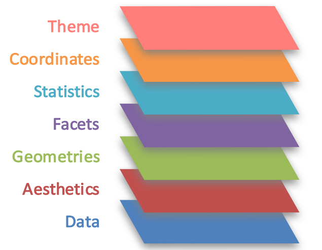
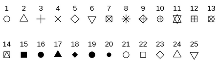
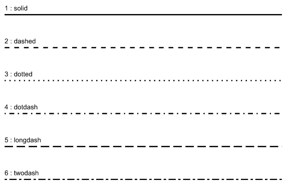

# Data Visualization et Ggplot2 : aspects théoriques {#sec-Ggplot-theorique}

## Présentation générale de Ggplot2

Le package **`ggplot2`** (inclus dans le package `tidyverse`) est l'un des atouts de **`R`** et permet de réaliser de beaux graphiques ; vous en trouverez <a href="https://ggplot2.tidyverse.org/index.html" target="_blank">ici</a> la présentation officielle. L'inconvénient, surtout pour quelqu'un qui serait habitué à construire des graphiques sous excel, est qu'il faut (presque) tout paramétrer, ce qui peut finalement donner un code très long.  L'architecture globale de **`ggplot2`** est souvent représentée par le schéma ci-dessous :



Pour le lire, il faut partir du bas du schéma :

-   par "Data", nous devons d'abord préciser la base ou le tableau de données utilisé(e) qui contient la ou les variables qui seront représentées ;
-   par "aesthetics", nous allons ensuite indiquer les variables qui seront projetées sur le graphe ;
-   par "geometries", nous indiquons le type de graphique utilisé ou la forme géométrique ;
-   par "facets", nous pouvons *éventuellement* (facultatif donc) diviser ou découper le graphique en plusieurs graphes (ou "panneaux") dépendant d'une autre variable par exemple ;
-   par "statistics", nous pouvons *là aussi éventuellement* ajouter des statistiques ;
-   par "coordinates", nous pouvons *là aussi éventuellement* changer le sens du graphique ;
-   enfin, par "theme", nous pouvons utiliser *éventuellement* l'un des thèmes graphiques diponibles et/ou ajouter un certain nombre d'options sur ce qui "entoure" le graphique, c'est-à-dire les positions et/ou couleurs et/ou taille, etc., des axes, titre, légende, etc.

### Les "aesthetics" ou arguments esthétiques

Il s'agit principalement d'indiquer quelle variable sera utilisée en abcisse (`x=`), et laquelle sera éventuellement utilisée en ordonnée (`y=`).\
Mais on peut aussi ajouter des variables supplémentaires qui seront différenciées par :

-   couleur, avec `color=` (pour des points, lignes ou symboles) ou `fill=` (pour le contenu des bâtons ou symboles) ;
-   taille avec `size=` ;
-   symbole avec `shape=` ;
-   type de lignes avec `linetype=` ;
-   degré de transparence avec `alpha=` (mais non conseillé pour les variables discrètes).

La **nuance à bien comprendre** est qu'utiliser ces options à l'intérieur de la fonction `aes()` revient à ajouter une 3ème variable (une légende apparaîtra alors automatiquement), alors que si l'on veut simplement changer l'aspect des points, lignes, barres, etc., d'une variable déjà projetée, il faut appeler (souvent) ces mêmes options à l'intérieur de la fonction `geom_***()` par exemple. Dans ce cas-là, on peut changer la couleur des points avec `color=` , la taille des points ou lignes avec `size=`, l'épaisseur des barres avec `width=`, etc. C'est la différence entre le "mapping" et les "settings".

Chacune de ces options ont des modalités différentes, il peut être bien d'avoir des mémos rangés dans un dossier créé pour cela pour éviter de les chercher à chaque fois.  Par exemple, pour les couleurs, vous trouverez un mémo <a href="https://www.datanovia.com/en/blog/awesome-list-of-657-r-color-names/" target="_blank">ici</a>, ou un bon récapitulatif <a href="https://larmarange.github.io/analyse-R/couleurs.html" target="_blank">là</a>. On peut également utiliser la fonction `colours()` dans `R` pour voir la liste complète des couleurs standard.

Pour la liste des symboles ("shape") et le numéro correspondant que l'on appelera avec l'argument `shape=`, ci-dessous un récapitulatif : 

Et voici pour la liste des types de lignes, avec `linetype=` : 

### Les géométries

Une fois les variables appelées, il faut définir le type de graphique. Il y a beaucoup de choix possibles inclus dans **`ggplot2`**, le tout est de bien comprendre quel type de graphique convient le mieux à ou aux variables utilisées et à ce que l'on veut montrer (cf. section suivante sur les grands principes de la data visualization). Voici un tableau récapitulant les principales "geometries".

| Fonction | Type de graphique | Type de variable(s) |
|:-----------------------|:-----------------------|:-----------------------|
| `geom_histogram()` | Histogramme | 1 variable continue |
| `geom_density()` | Courbe de densité | 1 variable continue |
| `geom_area()` | Graphique en aires empilées | 1 variable continue |
| `geom_col()` | Graphique en bâtons | 1 variable discrète |
| `geom_point()` | Nuage de points | 2 variables continues |
| `geom_jitter()` | Nuage de points dispersés | 2 variables continues |
| `geom_boxplot()` | Boîte à moustache | 1 variable continue, sans ou avec 1 variable discrète |
| `geom_violin()` | Graphes en violon | 1 variable continue, sans ou avec 1 variable discrète |
| `geom_bar()` | Graphique en bâtons | 1 variable continue, sans ou avec 1 variable discrète |
| `geom_line()` | Lignes | Fonction continue selon une variable de date |
| `geom_area()` | Graphique en aires empilées | Fonction continue selon une variable de date |

: **Tableau : Les principales fonctions "geometries" de Ggplot**

Certaines d'entre elles ont des options à préciser, presque de façon obligatoire comme nous l'avons déjà vu avec `geom_histogram()` et l'option `bins=`, si elle n'est pas précisée, elle sera "forcée" par `R` mais un message d'avertissement en rouge apparaîtra.\
Il en existe bien sûr plein d'autres, il faut dans ce cas rechercher sur internet ou aller voir sur la "cheatsheet" de ggplot2 disponible sur internet.

Il est possible de faire suivre plusieurs fonctions `geom_***()` : par exemple un `geom_line()` après un `geom_point()`, un `geom_text()` après un `geom_bar()`, etc. Dans ce cas, des variables supplémentaires peuvent être ajoutées (ou remplacer les précédentes) avec une nouvelle fonction `aes` à l'intérieur de ce `geom_***()` ; un exemple assez courant est la construction d'un graphique en bâtons avec l'ajout des valeurs de la variable à l'intérieur des bâtons (ou juste au-dessus), on fera alors appel à deux fonction `geom_***()` comme ceci : `data %>% ggplot() + aes(x=, y=) + geom_bar() + geom_text(aes(label=))`. De même, il est possible de spécifier des données (`data`) différentes pour chaque `geom_***()` .

### Les facettes

Il y a deux types de facettes (en réalité trois, avec celle par défaut qui s'intitule `facet_null()` et produit un seul graphe) :

-   `facet_wrap()` : produit une suite de graphiques et a un argument principal `facets=vars()` et éventuellement `ncol=` et `nrow=` ;
-   `facet_grid()` : produit une grille ou matrice de graphiques définies par une ou deux variables qui forment les lignes et les colonnes, définies avec les deux arguments principaux `cols=` et `row=`, ou en indiquant un `~` entre les deux variables.\
    À savoir, il y a des options pour contrôler les échelles avec l'argument `scales=`.\
    Les facettes sont ainsi une autre façon, par rapport aux "aesthetics", de représenter deux variables par rapport à une troisième variable.

### Les statistiques

On peut vouloir ajouter sur un graphique des statistiques particulières ou supplémentaires, comme la moyenne ou médiane d'une variable quantitative, ou encore représenter la régression linéaire dans le cas d'une variable fonction d'une autre, etc.\
Par exemple, si l'on projette des boîtes à moustache, la moyenne n'étant pas affichée on peut la rajouter avec la fonction `stat_summary()` et l'option `fun = mean`.\
Si l'on souhaite ajouter une régression linéaire sur un graphique de nuage de points, il faut utiliser la fonction `geom_smooth()` et l'option `method=lm`.\
Certaines statistiques peuvent aussi être calculées ou transformées directement dans certaines fonctions : c'est par exemple le cas avec la fonction `geom_histogramm()` où l'on peut produire un histogramme de la densité en spécifiant `y=..density..` dans l'`aes()` ou en la superposant à l'aide d'une courbe à l'histogramme initial en ajoutant alors ensuite un `geom_density()` ; ou encore avec la fonction `geom_bar()` avec les arguments `stat = "summary_bin", fun = mean` (par défaut, `stat = "count"`, dans ce cas la hauteur des barres représente le comptage des cas dans chaque catégorie).

### Les coordonnées

Les systèmes de coordonnées linéaires permettent de changer le sens du graphique ou de "zoomer" sur le graphique :

-   `coord_cartesian()` : c'est le système de coordonnées par défaut (repère "cartésien"), en changeant les arguments `xlim=` ou `ylim=`, on procède à un zoom sur l'axe des abscisses et/ou celui des ordonnées ; cela permet de ne pas supprimer des données comme le ferait les fonctions `scale_x_continuous()` ou `scale_y_continuous` mais juste de ne pas les afficher sur le graphe ;
-   `coord_flip()` : permet d'inverser les axes ;
-   `coord_fixed()` : produit un système de coordonnées cartésiennes avec un "ratio d'aspect" fixe.

Il existe également des systèmes de coordonnées non-linéaires, comme `coord_polar()` par exemple.

### Les thèmes

Il y a plusieurs thèmes existants dans le package **`ggplot2`**, `theme_gray()` est le thème par défaut ; les autres sont présentés dans la figure ci-dessous. \ 


Ensuite, la fonction `theme()` permet de modifier les aspects du graphique : il y a un certain nombre d'arguments disponibles qui permettent de modifier les éléments entourant le graphique comme les titre et sous-titre, les éléments à l'intérieur du graphique c'est-à-dire de la grille, les éléments des axes, ou encore les éléments de la légende (ou sa position sur la figure), etc.\
La figure ci-dessous est une bonne synthèse de la manière dont il faut programmer ces différentes éléments du thème d'un graphique (téléchargeable directement <a href="https://github.com/claragranell/ggplot2/blob/main/ggplot_theme_system_cheatsheet.pdf" target="_blank">ici</a>) :\


### Les autres options graphiques : titres, échelles des axes, etc.

Pour le titre général, mais aussi les titres des axes, ainsi qu'une éventuelle légende, source, etc., on peut les rassembler dans la fonction `labs()` :

```{r eval=FALSE}
labs(
  title    = " ",
  subtitle = " ",
  x        = " ",
  y        = " ",
  caption  = " ")
```

Les axes des échelles peuvent être changés, ainsi que les valeurs affichées, avec les fonctions `scale` : si les variables sont quantitatives/continues, avec `scale_x_continous()` et `scale_y_continuous()` ; si les variables sont qualitatives/discrètes, avec `scale_x_discrete()` et `scale_x_discrete()` ; dont les options les plus souvent utilisées sont `limits=`, `breaks=`, `labels=`, ou encore `trans=` qui permet de transformer la mesure de l'échelle (exponentielle, log, ...). Lorsqu'une option `fill=` ou `color=` est utilisée dans un `aes`, alors on peut modifier le type de couleurs ou palettes utilisées avec par exemple `scale_fill_brewer()` pour la pallette de couleur `RBrewer` ou `scale_fill_viridis()` pour la palette `Viridis`, etc.

Il y a encore d'autres fonctions qui permettent de "customiser" à votre goût un graphique `ggplot`, il faut s'aventurer dans les diverses documentations plus complètes sur le package **`ggplot2`**.

### Code minimal

Après l'appel de la fonction `ggplot()`, chaque "couche" supplémentaire utilisée est précisée par le signe **`+`** et non l'habituel pipe `%>%` pour bien signifier qu'on est toujours dans la fonction `ggplot()`, par ailleurs il faut faire attention de mettre le signe **`+`** à la fin d'une ligne et ensuite de faire un saut de ligne (le contraire saut de ligne et début de la ligne suivante avec le `+` ne fonctionnera pas). Les trois arguments obligatoires sont donc les 3 premières : "data", "aesthethics" et "geometries". En langage tidyverse, il existe plusieurs façons d'écrire le code :

```{r eval=FALSE}
# Les 4 façons d'écrire suivantes sont similaires :
data %>%              # on spécifie la table de données
  ggplot() +          # on appelle la fonction ggplot()
  aes(x = , y = ) +   # on spécifie dans l'aes() les variables à mettre dans l'axe  
                      # des abcisses (x=) et dans l'axe des ordonnées (y=)
  geom_histogram()    # on trace l'histogramme

data %>% ggplot(aes(x = , y = )) + geom_histogram() 
ggplot(data) + aes(x = , y = ) + geom_histogram() 
ggplot(data, aes(x = , y = ))  + geom_histogram()
```

Nous privilégierons ici la 1ère d'entre elles, mais vous pouvez en choisir une autre !

### Liens utiles pour aller plus loin

Nous ne pouvons pas résumer l'ensemble des possibilités données par **ggplot2** ; il faudra donc rechercher par soi-même si besoin. Voici pour cela deux sites très complets sur le package :

-   <a href="https://ggplot2-book.org/toolbox.html">https://ggplot2-book.org/toolbox.html</a>\
-   <a href="https://bookdown.org/ael/rexplor/chap8.html#aes">https://bookdown.org/ael/rexplor/chap8.html#aes</a>

## Les grands principes de data visualization

Sans prétendre, ni pouvoir, faire un cours complet de data visualization, voici quelques grands principes à essayer de respecter quand on souhaite représenter graphiquement des résultats issus du traitement de données :

-   savoir au préalable le message principal que l'on souhaite faire passer : cela peut sembler évident, mais il faut toujour avoir cela en tête ;
-   construire un graphique intelligible par le plus grand nombre : des graphiques trop sophistiqués, trop chargés d'informations, etc., ne permettront pas de transmettre le message souhaité. Cela peut bien sûr varier selon le public, mais... ;
-   situer le graphique : avec un titre explicite, éventuellement un sous-titre, ensuite avec une légende reprenant le champ et/ou la source, etc. ;
-   choisir le "bon" graphique selon le type de variables à représenter : variable continue ou discrète, croisement d'un type de variable avec un autre type, variables dépendant du temps (évolution), etc. ;
-   présenter le graphique de manière la plus objective possible : ne pas "tordre" le graphique pour faire apparaître un résultat qui n'est pas si évident que cela (c'est typiquement l'exemple d'un changement d'échelle ; d'un "zoom" sur l'axe des 'y' sur un graphique en évolution par exemple, pour montrer des variations qui ne seraient pas visibles si l'axe commençait à 0) ;
-   rajouter des informations (étiquettes de nom, valeur, etc.) sans trop surcharger le graphique néanmoins ;
-   être logique dans la contruction des éléments extérieurs au graphe : par exemple, ordre des modalités d'une légende située à droite selon le point d'arrivée des courbes ; ordre des modalités d'une variable discrète (par exemple le niveau de diplôme) ou selon la moyenne/médiane d'une autre variable par ordre croissant ou décroissant ; utiliser (le plus possible) des axes similaires pour comparer deux grahes côte à cote.

Ce chapitre de cours donne des conseils synthétiques : cf. <a href="https://rafalab.github.io/dsbook/data-visualization-principles.html" target="_blank">ici</a> ; ou cet article-<a href="https://www.sciencedirect.com/science/article/pii/S2666389920301896" target="_blank">là</a>.
