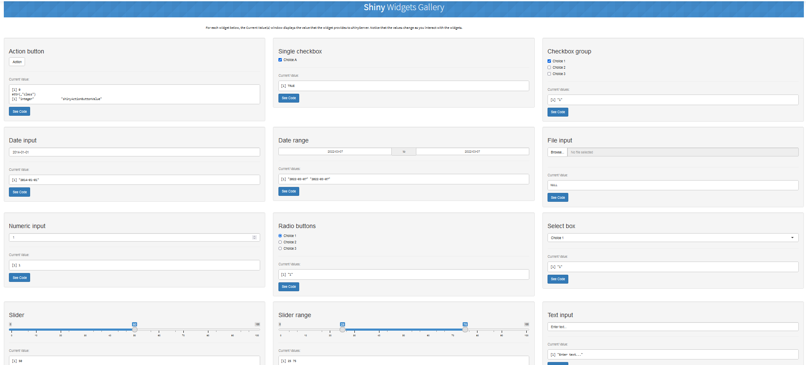
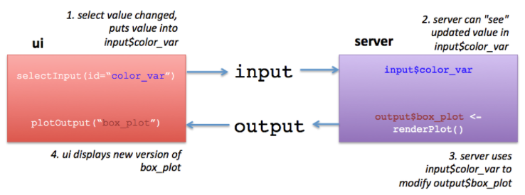
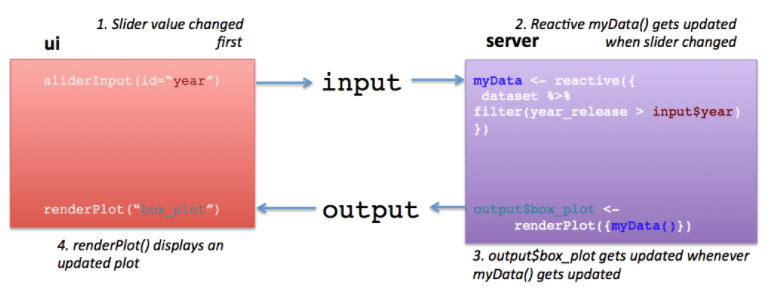

# Les applications interactives avec Shiny App {#sec-Intro-a-Shiny-theorique}

Comme indiqué sur la page officielle de Shiny-RStudio <a href="https://shiny.posit.co/r/getstarted/shiny-basics/lesson1/" target="_blank">ici</a>, Shiny est un package R qui permet de créer des applications ou des pages web de visualisations interactives de données, directement à partir de R, autremet dit sans connaître nécessairement le langage HTML, Javascript, etc., et donc aussi en pouvant utiliser toutes les fonctions disponibles sous R. En réalité, l'interface utilisateur de l'application Shiny est bien du langage HTML, mais Shiny donne des outils faciles pour l'écrire sans avoir à connaître le HTML.

Il nous faut d'abord installer le package **`Shiny`**, puis le charger :

```{r warning=FALSE, message=FALSE}
#install.packages("shiny")
library(shiny)
```

Des exemples d'application Shiny sont données sur la page officielle dans la <a href="https://shiny.posit.co/r/gallery/" target="_blank">galerie</a> ; ou on peut aussi en lancer une directement dans R, avec par exemple le code suivant :

```{r eval=FALSE}
# Voici la liste des exemples que vous pouvez spécifier dans la fonction 
# suivante : "01_hello", "02_text", "03_reactivity", "04_mpg", 
# "05_sliders", "06_tabsets", "07_widgets", "08_html", "09_upload",
# "10_download", "11_timer"
runExample("01_hello")
runExample("05_sliders")
```

Un autre exemple d'application finale qui comprend un aspect territorial donc avec de jolis cartes, et qui s'appuie sur les données du Recensement de la population (rassemblées par l'Insee sur la période 1968-2019 et qui forme la base Saphir), est disponible <a href="https://francestrategie.shinyapps.io/app_seg/" target="_blank">ici</a> .

Enfin, cette introduction s'appuie sur d'autres ressources externes, pour n'en citer que quelques uns : - un bon tutoriel <a href="https://deanattali.com/blog/building-shiny-apps-tutorial/" target="_blank">ici</a> ; - une introduction claire <a href="https://laderast.github.io/gradual_shiny/introduction.html" target="_blank">là</a>. Et vous trouverez sur les 2 liens suivants deux ouvrages en ligne, pour compléter et aller plus loin : the <a href="https://mastering-shiny.org/index.html" target="_blank">Mastering Shiny</a> ; et the <a href="https://plotly-r.com/" target="_blank">Interactive web-based data visualization with R, plotly, and shiny</a>.

## La structure générale d'une application Shiny

L’application est divisée en 2 sections : l’**interface utilisateur** (**ui**) et une **fonction serveur** (**server**). L’intérêt de Shiny est sa réactivité : quand l’utilisateur change un paramètre, tout ce qui dépend de ce paramètre est automatiquement actualisé sur la page. On dit que c'est une application "server-based", dans la mesure où la construction des graphiques et/ou des tableaux affichés (ou tout autre objet) se font sur le serveur, autrement dit sur le RStudio de votre ordinateur.
\  
Ainsi, comme on peut le voir sur les exemples cités au-dessus, la structure du code sera toujours la suivante :

```{r eval=FALSE}
library(shiny)

# Fonction "ui"
ui <- fluidPage(
                )

# Fonction "server"
server <- function(input, output) {
  
                   }

# Fonction qui crée l'application Shiny en reprenant les 2 fonctions 
# principales. A noter que comme elles ont le même nom, souvent on ne 
# précisera pas de nouveau les arguments "ui = " et "server = "
shinyApp(ui = ui, server = server)

```

### La partie "UI"

L'**`UI`** ou "interface utilisateur" utilise par défaut la fonction **`fluidPage()`** qui permet de créer la mise en page de l’application et qui répondra automatiquement aux changements effectués sur le navigateur par l'utilisateur.
\ 
Cette fonction `fluidPage()` va contenir des indications comme le titre (avec **`titlePanel()`**), éventuellement un sous-titre, etc., ainsi que deux fonctions **`sidebarLayout()`** et **`mainPanel()`**.
\ 
Le première comprend la fonction `sidebarPanel()` qui contient le ou les "widgets" à partir duquel ou desquels les utilisateurs sélectionneront des valeurs – par défaut est indiqué un `sliderInput()`. La seconde contient la sortie voulue, c’est-à-dire un graphique, un tableau, etc., avec par défaut la fonction `plotOutput()`, mais elle peut en contenir d’autres... Les graphiques ou tableaux de ces fonctions `...Ouput()` sont ensuite précisées (et construits) dans la partie "**Server**" de l’application Shiny.

```{r eval=FALSE}
#library(shiny)

# Fonction "ui"
ui <- fluidPage(
  # Titre de l'application
  titlePanel("Titre à définir"),
  
  # Mise en page de la barre latérale avec les définitions des 
  # entrées et des sorties
  sidebarLayout(
    
    # Panneau latéral pour les entrées
    sidebarPanel(
      
      # Entrée : wigdet choisi, par défaut "sliderInput()"
      sliderInput(
        
      )
      
    ),
    # Panneau principal pour l'affichage des sorties
    mainPanel(
      # Sortie : graphique, tableau, etc.
      plotOutput("nom_du_graphe")
      )
    )
  )

# Fonction "server"
server <- function(input, output) {
  
                   }

# Fonction qui crée l'application Shiny
shinyApp(ui = ui, server = server)

```

La liste des widgets est reproduite ci-dessous avec un tableau et une image récapitulative (disponible directement <a href="https://shiny.rstudio.com/gallery/widget-gallery.html" target="_blank">ici</a>) ; à part les arguments communs `inputID()` et `label()`, les autres arguments diffèrent selon le widget, il est donc essentiel d’y faire un tour avant d’en utiliser un si l’on ne le connaît pas *a priori*.

| Fonction | Widget |
|:---|:---|
| sliderInput | Barre de défilement |
| actionButton | Bouton d'action |
| checkboxGroupInput | Groupe de cases à cocher |
| checkboxInput | Case unique à cocher |
| dateInput | calendrier pour sélectionner une ou des dates |
| dateRangeInput | Paire de calendriers pour sélectionner une plage de dates |
| numericInput | Champ pour saisir des chiffres |
| radioButtons | Série de boutons radio |
| selectInput | Boîte avec des choix à sélectionner |
| submitButton | Bouton de validation |
| fileInput | Commande pour télécharger un fichier à partir d'un chemin |
| textInput | Champ pour saisir du texte |
| helpText | Texte d'aide qui peut être ajouté à un formulaire de saisie |

: **Tableau : Fonctions Shiny et widgets associés**

**Widgets de l'application Shiny**



D'autres interfaces utilisateur existent. Par exemple, avec le package **`bslib`**, on peut utiliser la fonction `page_sidebar()` à la place de `fluidPage()`, comme ceci :

```{r eval=FALSE}
#library(shiny)
library(bslib)

# Fonction "ui"
ui <- page_sidebar(
  
  title = "Titre à définir",
  
  sidebar = sidebar("Barre latéral"),
  
  "Contenu principal",

  mainPanel(
      # Sortie : graphique, tableau, etc.
      plotOutput("nom_du_graphe")
      )
)

# Fonction "server"
server <- function(input, output) {
  
                   }

# Fonction qui crée l'application Shiny
shinyApp(ui = ui, server = server)

```

Ou encore la fonction `navbarPage()` pour permettre plusieurs onglets de navigation sur la même page web (que l'on créera avec la fonction `tabPanel()` à l'intérieur de laquelle on retrouvera les fonctions `sidebarPanel()` et `mainPanel()`) :

```{r eval=FALSE}

# Fonction "server"
ui <- navbarPage(

  title="Titre à définir",
  
  tabPanel(title = "Graphique",
           fluidPage(
             sidebarLayout(
               sidebarPanel(
                 # sliderInput(
                 #    )
                 ),
               mainPanel(
                 plotOutput("nom_du_graphe")
                 )             
               )
           )
           ),
  
  tabPanel("Résumé des variables"),
  
  tabPanel("Tableau"),
   
    )

# Fonction "server"
server <- function(input, output) {
  
                   }

# Fonction qui crée l'application Shiny
shinyApp(ui = ui, server = server)
```

### La partie "Server"

C’est la fonction **`Server`** qui contient le code principal faisant tourner l’application web.
\  
Elle est définie par la fonction `function(input, output){ }`. À chaque fonction `...Ouput()` dans l'**ui** correspond une fonction `render...()` dans la partie **`Server`**. Par exemple, si dans la partie **`ui`**, on a défini un histogramme comme ceci dans la fonction : `plotOuput("distPlot")`, alors dans la partie **`server`**, on associera la fonction `renderPlot()` à `output$distPlot`. Les fonctions `render...()` sont celles qui contiennent en effet le code créant l’histogramme ici, ou tout autre graphique ou tableau, l’ensemble de l’expression à l'intérieur de cette fonction sera contenu dans des accolades `{}`.

```{r eval=FALSE}
#library(shiny)

# Fonction "ui"
ui <- fluidPage(
    # Titre de l'application
  titlePanel("Titre à définir"),
  
  # Mise en page de la barre latérale avec les définitions des 
  # entrées et des sorties
  sidebarLayout(
    
    # Panneau latéral pour les entrées
    sidebarPanel(
      
      # Entrée : wigdet choisi, par défaut "sliderInput()"
      sliderInput(
        
      )
      
      ),
    
    # Panneau principal pour l'affichage des sorties
    mainPanel(
      # Sortie : graphique, tableau, etc.
      plotOutput("nom_du_graphe")
      )
    
    )
  
  )

# Fonction "server"
server <- function(input, output) {
  
  # Reprend la sortie mentionnée plus haut (ici "nom_du_graphe")
  output$nom_du_graphe <- renderPlot({
    
    # code de création du graphique, qui sera réactive selon les 
    # valeurs données en entrées (cf. fonction "fluidPage()")
    
  })
                   }

# Fonction qui crée l'application Shiny
shinyApp(ui = ui, server = server)

```

Voici les différentes fonctions `...Ouput()` créant un objet de sortie :

| Fonction de sortie | Type d'objet créé |
|:-------------------|:------------------|
| dataTableOutput    | Table de données  |
| imageOutput        | Image             |
| plotOutput         | Graphique         |
| tableOutput        | Table             |
| textOutput         | Texte             |
| uiOutput           | HTML brut         |
| htmlOutput         | HTML brut         |
| verbatimTextOutput | Texte             |

Et les fonctions `render...()` associées :

| Fonction de sortie | Type d'objet créé |
|:---|:---|
| renderDataTable | Table de données |
| renderImage | Image (enregistré comme un lien vers un fichier source) |
| renderPlot | Graphique |
| renderTable | Table de données, matrices, ou autres structures de type tableau |
| renderText | Texte sous forme de chaînes de caractères |
| renderUI | objet de balise Shiny ou HTML |
| renderPrint | Toute sortie imprimée |

## La réactivité

Comme dit précédemment, la réactivité est au centre du fonctionnement d'une application Shiny. Plusieurs types de réactivité peut être distingués :

-   un *premier type de réactivité*, le plus simple, à travers les interactions entre les fonctions **`ui()`** et **`server()`** : comme expliqué au-dessus, cela passe par les "input" définis dans la partie **ui** et les "output" créés dans la partie **server** ; plus précisément, si on a défini un widget permettant par exemple de choisir une année donnée et qu'on l'a appelé `annee` (avec l'argument `id=" "`), alors dans la ou les fonctions `render...()` de la partie **server**, il faudra renvoyer à cette variable par l'indication `input$annee`. De manière générale, il faudra accoler le nom donné à un input `x` de cette façon dans le **server** : `input$x`.
\ 
Cela peut être résumé par le schéma suivant, emprunté à l'une des sources citées en introduction :



*Source : https://laderast.github.io/gradual_shiny/introduction.html*

-   un *deuxième type de réactivité à travers la base de données elle-même*, c'est-à-dire qui crée un objet réactif (qui sera à la fois une entrée réactive et une sortie réactive) : il faut alors utiliser, par exemple, la fonction `reactive({})` (ou son corrolaire `eventReactive()`) en l'appliquant à la base de données initiale et en renvoyant ainsi une nouvelle base, qui sera elle-même une fonction. On peut par exemple appliquer un filtre à notre base de données selon l'année : au lieu alors de préciser `input$annee` dans la fonction `render...()` comme mentionné dans le premier type de réactivité, on va en réalité créer une nouvelle base comme ceci : `data_reactive <- reactive({ data %>% filter(annee == input$annee)) })` ; puis l'appeler ainsi pour créer le graphique : `output$nom_du_graphe <- renderPlot({ data_reactive() })`, attention vous noterez l'utilisation des parenthèses après le nouveau nom de la table. De même, cela peut être résumé par le schéma suivant tiré de la même source :



*Source : https://laderast.github.io/gradual_shiny/app-2-reactives.html*

-   un *troisième type de réactivité qui crée un contexte réactif*, à travers notamment la fonction `observe({})` (ou son corrolaire `observeEvent()`) : cette fonction sera utilisée losque vous souhaitez faire une opération qui dépend de plusieurs autres variables réactives, en particulier si vous souhaitez changer un input qui est dépendant d'un autre input, mais sans créer nécessairement d'output. Cela peut être utile si le choix d'une variable - les départements d'une région par exemple - est conditionnée au choix antérieur de la région en question : dans ce cas, l'utilisateur qui choisira une région dans un premier widget ne verra s'afficher que les départements de cette région dans un second widget et non tous les départements disponibles dans la base de données.

Il y a bien d'autres fonctions de réactivité dans Shiny : `eventReactive()`, `observeEvent()`, `reactiveValues()`, `isolate()`, `req()`, qu'on ne présentera pas forcément en détails dans ce cours mais que vous pourrez utiliser dans votre application finale.

## Un exemple avec le code du script par défaut

Voyons ensemble un premier exemple : dans **RStudio**, ouvrez un nouveau fichier "Shiny Web App..." que vous intitulez comme vous le souhaitez (attention, pas d'espace permis entre deux mots par exemple), vous laissez l'option "Single File" et vous l'enregistrez de préférence dans votre projet.
\ 
Un nouveau scrip s'ouvre avec par défaut un code minimal déjà écrit : on retrouve la structure du code présentée juste au-dessus, et à l'intérieur de l'UI et du Server quelques codes pour avoir un titre, un widget sous forme de "slider" et un graphique qui sera un histogramme d'après la fonction écrite dans la partie Server. Faisons tourner l'application avec le bouton en haut à droite "Run App" pour voir ce que cela donne ! On voit bien les différents éléments correspondants au code écrit dans le script R et on voit bien également que l'application est interactive puisque si l'on modifie le nombre de classes dans la barre slider, le graphique est modifié alors simultanément !
