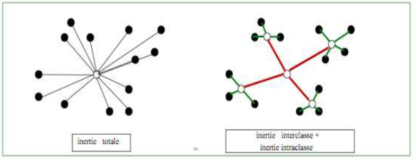
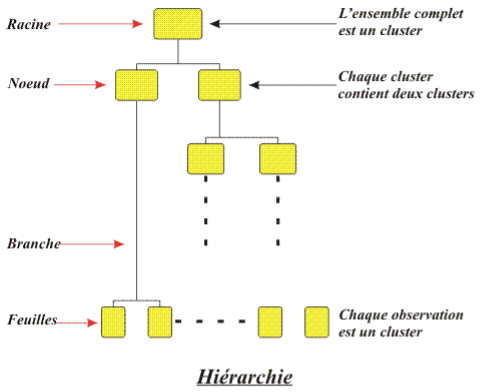
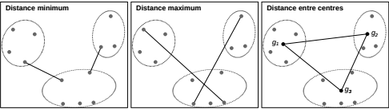
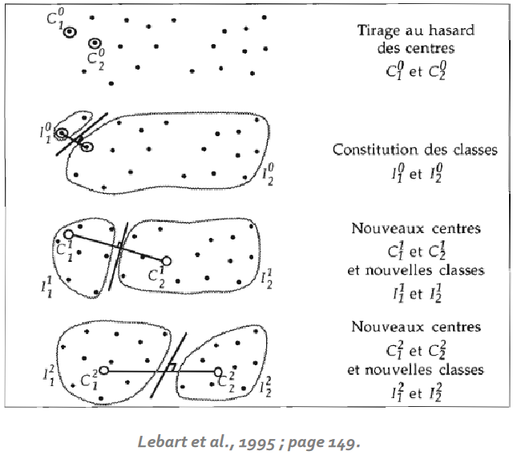

# Clustering : aspects théoriques {#sec-Clustering-theorique}

Les méthodes de **clustering** (ou typologie, ou segmentation, ou encore classification en français[^11-clustering-theorique-1]) appartiennent à la famille des algorithmes d'apprentissage non supervisé, car nous n'avons pas de variable de sortie ou variable-cible.\
Ce sont justement les algorithmes qui vont chercher à organiser les observations en groupes ou classes dit "clusters" en fonction de variables quantitatives choisies en entrée/input dans le modèle. L'algorithme va ensuite chercher à ce que ces "clusters" soient à la fois le plus similaire possible à l’intérieur/en leur sein (forte "similarité intraclasse", on cherche alors à **minimiser l'inertie intraclasse**) et le plus distinctif/différent des autres groupes/classes (faible "similarité interclasse", on parlera de **maximisation de l'inertie interclasse**). Ces observations peuvent être des individus, des entreprises, ou comme ici pour nous, un niveau territorial (la commune).\

[^11-clustering-theorique-1]: Attention néanmoins à l'usage du terme "classification" car en anglais et dans la plupart des ouvrages de Data Science et de Machine Learning, ce terme renvoie aux techniques d'analyse prédictive dont la variable cible (d'intérêt) est qualitative (en opposition aux régressions pour lesquelles la variable cible est quantitative). L'usage du terme "clustering" est ainsi privilégié.

*Source : document de cours accessible ici http://iml.univ-mrs.fr/\~reboul/ADD4-MAB.pdf*

Il y a deux principales méthodes de clustering : hiérarchique et non hiérarchique, la principale différence étant que pour la premiere on ne connaît pas par avance le nombre de groupes dans lesquels seront réparties nos observations ; alors que pour la seconde, on fixe au préalable le nombre de groupes.

On va étudier ici deux exemples : pour le clustering hiérarchique, on va utiliser la méthode la plus courante - la classification ascendante hiérarchique (CAH) - qui utilise un algorithme ascendant, c'est-à-dire agglomératif (les classes sont construites par agglomérations successives des objets deux à deux ; cette méthode s'oppose aux algorithmes descendants ou divisifs) ; et pour le clustering non hiérarchique, la méthode également la plus utilisée - les centres-mobiles ou la méthodes des K-means (très légèrement différente). Pour d'autres exemples, vous pouvez vous référer respectivement aux pages 244-251, et 252-255, du manuel de référence du cours (Husson, 2018).

## La classification ascendante hiérarchique (CAH)

Voici une représentation générale d'un clustering hiérarhique :

*Source : document de cours accessible ici https://perso.univ-rennes1.fr/valerie.monbet/ExposesM2/2013/Classification2.pdf*

Il y a en gros **3 grandes étapes** :

- une *première étape, facultative*, car cela dépend de la nature des données : on centre et réduit les variables, on dit également qu'on "standardise" les variables. Cela est indispensable quand les variables ont des unités différentes (le poids et la taille d'un individu) ; si elles ont des unités similaires (c'est notre cas ici), il faut choisir de le faire ou non. Souvent, on va choisir de "standardiser" car on peut avoir des variables avec des écarts-types importants ce qui peut créer un biais (en faveur de ces variables, c'est-à-dire en leur donnant un poids plus important dans l'analyse) lors de la construction de la matrice de distances.

- une *seconde étape consiste à créer une matrice des distances* (ou des dissimilarités) car la construction de l'arbre (cf. ci-dessous) repose sur les distances entre observations/individus : l'idée est de chercher les individus les plus proches ou les plus ressemblants ; on commence donc par calculer la matrice des distances des individus deux à deux, puis on rassemble les deux plus proches dans un nouvel élément ce qui crée une matrice des distances sur les n-1 individus, ensuite on réitère le processus - on crée une matrice des distances rassemblant les deux individus les plus proches dans un nouveau groupe, etc. - jusqu'à ce qu'on ne dispose plus que d'un seul élément. Dans cette étape, on choisit le type de distance utilisé, c'est-à-dire le critère de ressemblance entre les individus. Sans rentrer ici plus dans les détails, la méthode de distance la plus utilisée et (ou car) la plus intuitive est la **distance euclidienne**. Mais par exemple, si nos variables ne sont pas mesurées en effectifs mais en proportion, il faudra plutôt utiliser la distance du khi-deux. Autre exemple, lorsque les variables seront qualitatives de type binaire (0/1), alors ce sera plutôt l’indice de similarité de Jaccard qui sera utilisé.

- enfin, la *troisième étape est la méthode d'agrégation* : dans la construction de la matrice de distance, après la 1ère étape (n-1 individus), ce seront progressivement des groupes d'individus dont on comparera la distance, il faut donc savoir comment calculer cette distance entre groupes (et non plus seulement entre individus) : est-ce qu'on prend le point représentant l'individu moyen du groupe ? Ou bien celui qui est à l'extrêmité du groupe ? Etc. Là aussi, il faut donc choisir cette méthode d'agrégation parmi un ensemble de méthodes (lien simple ou minimum, lien maximum, lien moyen, lien entre les centroïdes/centres de gravité ou barycentre, critère de Ward) : la plus utilisée est le critère de Ward, notamment lorsqu'on utilise une distance euclidienne dans l'étape précédente. Ce critère se base sur la décomposition de l'inertie totale (somme du carré des distances de chaque point au centre) en une inertie intraclasse et une inertie interclasse ; il consiste ensuite à minimiser la perte d'inertie intraclasse à chaque agrégation de classes, pour que les classes restent le plus homogène possible.

Un schéma de 3 de ces distances permet de mieux visualiser ce dont il s'agit :

*Source : document de cours accessible ici https://r.developpez.com/tutoriels/programmation-graphe/livre-R-et-espace/?page=chapitre-7-methodes-de-classification*

On doit ainsi aboutir à un arbre appelé *dendogramme*, dont le haut ou la "racine" est constituée d'une unique classe/cluster qui rassemble tous les individus, alors que le bas (l'ensemble des "feuilles") constituent des clusters à un individu donc avec une homogénéité, par définition parfaite. Selon la méthode d'agrégation utilisée, les dendogrammes pourront avoir des formes bien différentes (c'est ce que nous verrons dans l'exemple d'application), il ne faut donc pas hésiter à tester différentes méthodes pour rendre plus robuste le résultat final c'est-à-dire la classification, en gros elle sera robuste si le "haut" de l'arbre ne change pas trop (= on a toujours les même 3 ou 4 ou 5 grosses classes).

Un exemple d'application d'un clustering hiérarchique avec 7 individus, basée sur une distance euclidienne et la méthode de Ward, est disponible <a href="http://perso.ens-lyon.fr/lise.vaudor/classification-ascendante-hierarchique/" target="_blank">ici</a>.

## La méthode des centres mobiles et sa variante, *les K-means*

L'objectif est cette fois de construire une partition d'une population en *k* "clusters", ce nombre *k* étant fixé avant ou *a priori*. C'est la principale différence en réalité par rapport à la méthode précédente, et le résultat en sera une partition unique des données (contrairement à la CAH qui donne une sorte de hiérarchie de partitions avec le dendogramme, à partir de laquelle il faut choisir le nombre de classes).

L'algorithme des **centres mobiles** repose sur un processus itératif de plusieurs étapes : on détermine aléatoirement (c'est-à-dire au hasard) *k* individus/observations comme centres provisoires de classes, et on affecte chaque individu à la classe dont le centre est le plus proche, ce qui crée une première partition ; ensuite, on procède à un nouveau calcul des centres de gravité des classes de cette première partition, on redistribue les individus dans la classe dont le centre est le plus proche, ce qui permet d'aboutir à une seconde partition alternative ; on répète ce processus jusqu'à convergence (selon un critère que l'on peut définir), c'est-à-dire jusqu'à ce qu'aucun individu ne change de classe, ou lorsque l'inertie intra-classe ne diminue plus, ou encore lorsque les centres de classes sont stables, ou lorsque tout simplement on a atteint le nombre d'itérations que l'on avait fixé. Il y a donc, ici aussi (mais plus implicitement), une minimisation de l'inertie intra-classe. Une variante est qu'une actualisation ou un recalcul des centres de classe peut être fait dès qu'un individu change de classe ; néanmoins dans cette variance, l'ordre des individus joue dans le résultat final.

Voici une représentation graphique illustrant la méthode : 

Légèrement différente, la méthode des *k-means* va recalculer le centre de classe à chaque fois qu'un nouvel individu y est introduit, alors que précédemment on attendait que tous les individus soient affectés dans des groupes pour recalculer le centre de classe. Le nouveau calcul du cente de classe est donc ici effectué dès qu’un individu change de classe.

L'une des limites de cette méthode (et sa variante) est que la partition finale, résultat de ce processus itératif, dépend souvent des centres initiaux de classes qui ont été choisis, c'est pourquoi en pratique il est préférable d'exécuter plusieurs fois la procédure, et comme précédemment de choisir la partition la plus stable/robuste.

Cette méthode est souvent utilisée lorsque l'on a de grosses bases de données sur lesquelles faire tourner une CAH est très coûteuse en temps ; toutefois, le fait de devoir répéter plusieurs fois la procédure jusqu'à stabilité des classes peut atténuer cette avantage de rapidité de calcul pour les grandes bases. On peut l'utiliser aussi *en complément* d'une CAH là aussi sur de grosses bases de données, plus précisément comme étape préalable à une CAH, l'idée étant de choisir un très grand nombre de centres de classes pour réaliser la CAH sur ces centres considérés comme les individus, et ensuite aboutir à un nombre plus petit de classes finales, c'est ce qu'on appelle la méthode de classification ou *clustering mixte*.

